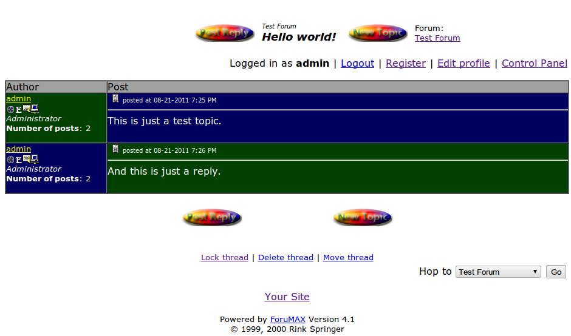
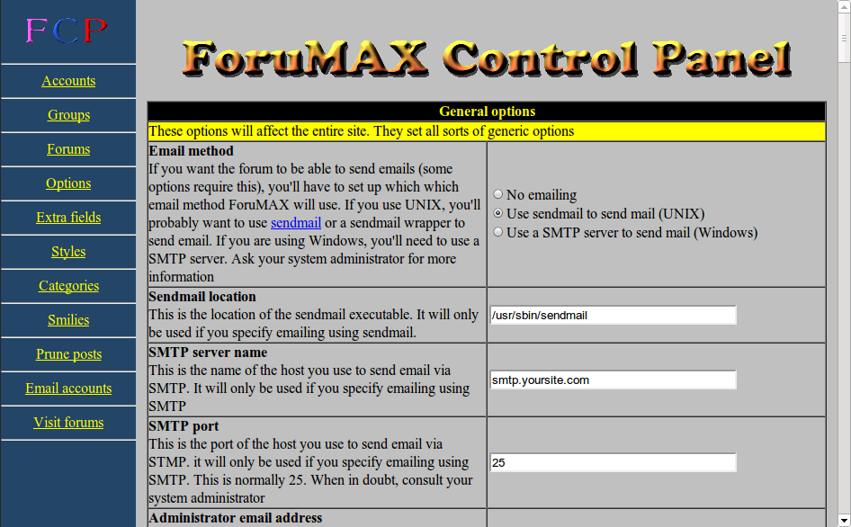
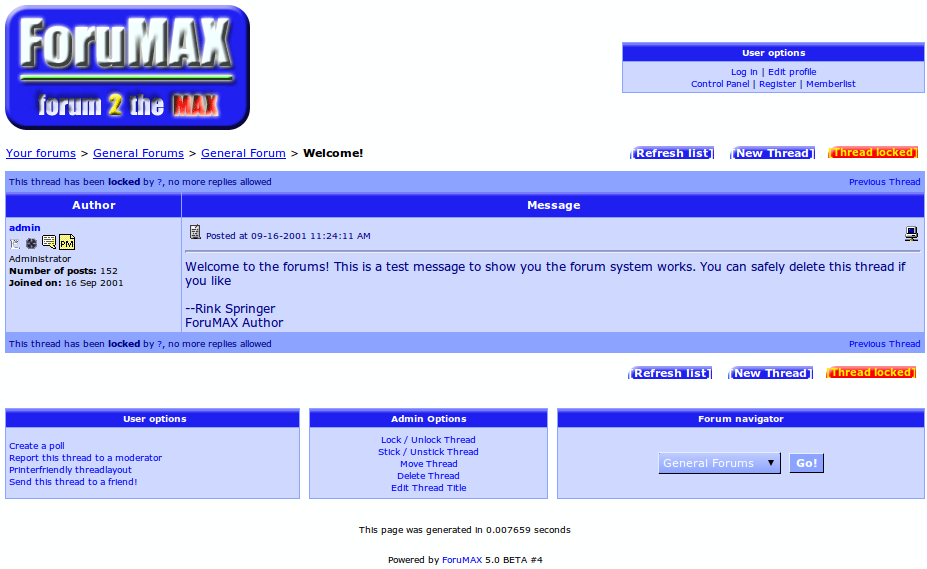
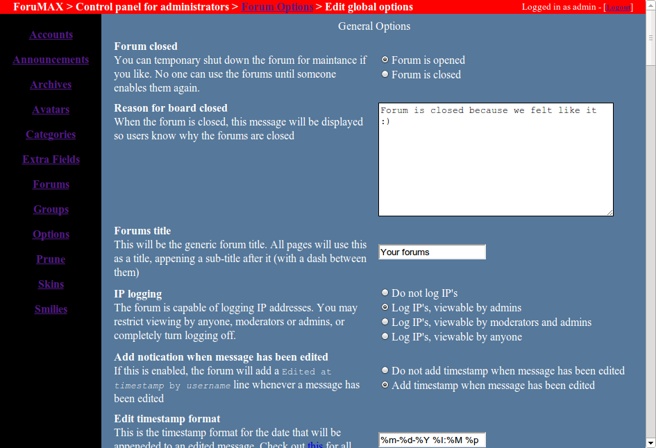

# ForuMAX

This used to be my commercial forum, which was initially written for the [Hero6 project](http://www.hero6.com). At Hero6, we couldn't affort the Ultimate Bulletin Board, so I decided to write one myself.

## Perl version

When I started work on ForuMAX, I just got a nice book about Perl for web-development; this was 1998 or so, and PHP didn't really exist back then. So, I decided to code a database-less (as SQL databases were not that common for webhosters at the time) forum - and as far as I know, no one has ever been able to corrupt the database, which I am still quite proud of :-)

## PHP version

In the early 2000's, using MySQL (3.23 at time time) became quite popular for websites, and PHP (3.0 was used at the time) seemed to be the website language of the future - so in order to teach my this language, I decided to rewrite ForuMAX in PHP and take advantage of SQL. This proved to be quite fun to do so at the time, as a lot of challenges I had before (like updating the database files) were so much nicer. This became ForuMAX 5, which was never officially released, it made it to beta #3.

## Lite version

Along with a friend, we started a company to aid in the market and development of ForuMAX. This unfortunately didn't take off, but we did manage to create a _lite_ version of ForuMAX which we intended to distribute for free. Sadly, both the lite version and the company never took off, so we abandoned both efforts after a while.

## ForuMAX 4 Screenshots

### A typical forum post

### Control panel options page

## ForuMAX 5 Screenshots

### A typical forum post

### Control panel options page

## Downloads

 * [readme.txt](releases/readme.txt) (4KB)
 * [ForuMAX 4.1](releases/forumax4/forumax41.tgz) (152KB)
 * [ForuMAX 4.1 MySQL module](releases/forumax4/mysql_module.tgz) (5KB)
 * [ForuMAX 5 beta 2](releases/forumax5/fm5beta2.tgz) (129KB)
 * [ForuMAX 5 beta 3](releases/forumax5/fm5beta3.tgz) (134KB)
 * [ForuMAX 5 development SQL snapshot](releases/forumax5/forumax5-current.sql) (250KB)
 * [ForuMAX 5 development sources snapshot](releases/forumax5/forumax5-current.tgz) (273KB)
 * [ForuMAX Lite](releases/extra/fm_lite.tgz) (17KB)
